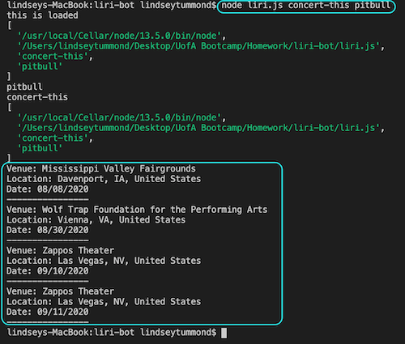

# LIRI Bot - Language Interpretation and Recognition Interface

## Problem App is Solving:
LIRI Bot solves the problem of searching Spotify for songs, Bands In Town for concerts, and OMDB for movies. It solves using multiple resources to find detailed information about songs, concerts, and movies in one centralized location.

## Overview: 
LIRI is a command line node app that takes in parameters and provides data based off the following commands:

-	concert-this
-	spotify-this-song
-	movie-this
-	do-what-it-says

## Technologies:
-	Javascript
-	Node.js
-	Node-Spotify-API
-	Axios:
    -	OMDB API
    -	Bands in Town API
-	Moment
-	DotEnv

## How to run the app:

### Bands In Town

