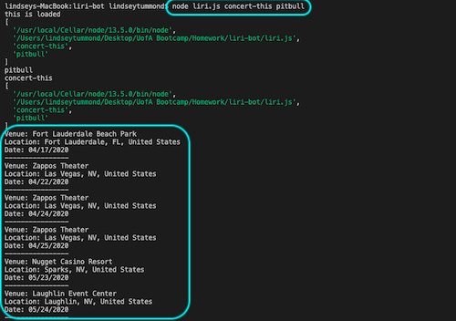
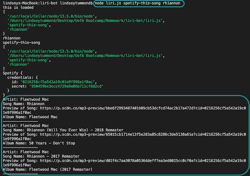
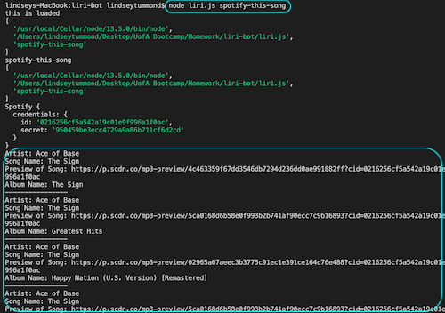
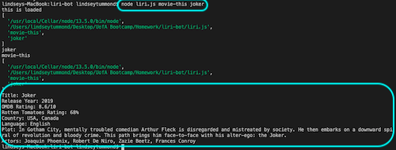
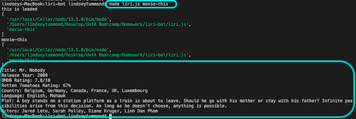
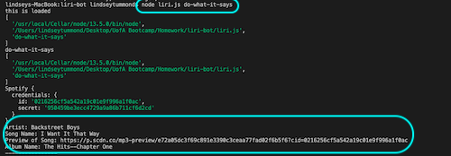

# LIRI Bot - Language Interpretation and Recognition Interface

## Problem the App is Solving:
LIRI Bot solves the problem of searching Bands In Town for concerts, Spotify for songs, and OMDB for movies. It solves using multiple resources to find detailed information about concerts, songs, and movies in one centralized location.

## Overview: 
LIRI is a command line node app (no client side) that takes in parameters and provides data based off the following commands:

-	`concert-this`
-	`spotify-this-song`
-	`movie-this`
-	`do-what-it-says`

## Future Enhancements:
Future developments would include creating front-end with a simple, user friendly UI.  Likewise, creating search fields and buttons would make it more approachable.

## Technologies:
-	Javascript
-	Node.js
-	Node-Spotify-API
-	Axios:
    -	OMDB API
    -	Bands in Town API
-	Moment
-	DotEnv

## How to run the app:

## Bands In Town

`node liri.js concert-this <artist/band name here>`

This will search the Bands in Town Artist Events API for an artist and render the following information about each event to the terminal:

-   Name of the venue
-   Venue location
-   Date of the Event (use moment to format this as "MM/DD/YYYY")

## Spotify

`node liri.js spotify-this-song <song name here>`

This will search the Node-Spotify-API for a song and render the following information to the terminal:

-   Artist(s)
-   The song's name
-   A preview link of the song from Spotify
-   The album that the song is from
-   If no song is provided the program will default to "The Sign" by Ace of Base.

## OMDB

`node liri.js movie-this <movie name here>`

This will search the OMDB API for a movie and render the following information to the terminal:

-   Title of the movie
-   Year the movie came out
-   OMDB Rating of the movie
-   Rotten Tomatoes Rating of the movie
-   Country where the movie was produced
-   Language of the movie
-   Plot of the movie
-   Actors in the movie
-   If no movie is provided the program will default to the movie "Mr. Nobody"

## LIRI Bot: Do What It Says

`node liri.js do-what-it-says`

Using the fs Node package, LIRI will take the text inside of random.txt and then use it to call one of LIRI's commands. In this instance, it will run `spotify-this-song` for "I Want it That Way" by The Backstreet Boys

# Osbourne Train Service - Train Scheduler

### Overview:
Train Scheduler app incorporates Firebase to host arrival and departure data. The app will retrieve and manipulate this information with `Moment.js`. The provides up-to-date information about various trains, specifically their arrival times and how many minutes remain until they arrive at their station.

## Author:
Lindsey Tummond
- <a href="https://lindseytummond.github.io/portfolio/" target="_blank"> Portfolio </a>
- <a href="https://github.com/lindseytummond" target="_blank"> GitHub </a>
- <a href="https://www.linkedin.com/in/lindsey-tummond-b86aa341/" target="_blank"> LinkedIn </a>

## Learning Points:
- Initialize and use Firebase as a real time database
- Utilization of `Moment.js` to validate and manipulate displaying time in Javascript
- Understanding of multiple files and how to link file structure

## Technologies:
-   HTML
-   CSS
-   Javascript
-   jQuery
-   GitHub
-   Bootstrap
-   Google Fonts
-   Firebase
-   Moment.js

## How the app works:
Use the following link https://lindseytummond.github.io/trainScheduler/ to open the application.  

1.  Osbourne Train Service allows users to add train service based on:

        * Train Name
    
        * Destination 
    
        * First Train Time -- in military time
    
        * Frequency -- in minutes
  
2.  The app calculates when the next train will arrive (relative to the current time).
  
3.  Users from various different machines are able to view same train times (Current Train Schedule).

## App Example:

  

